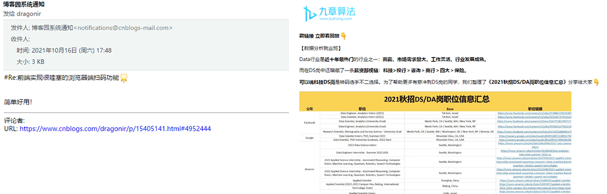
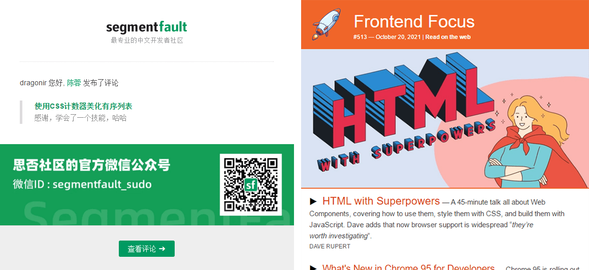
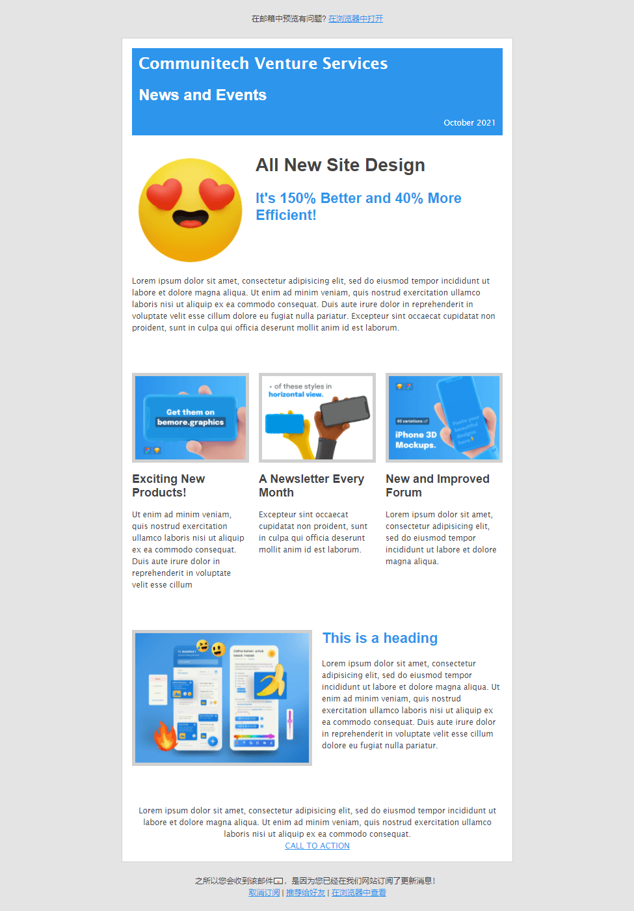
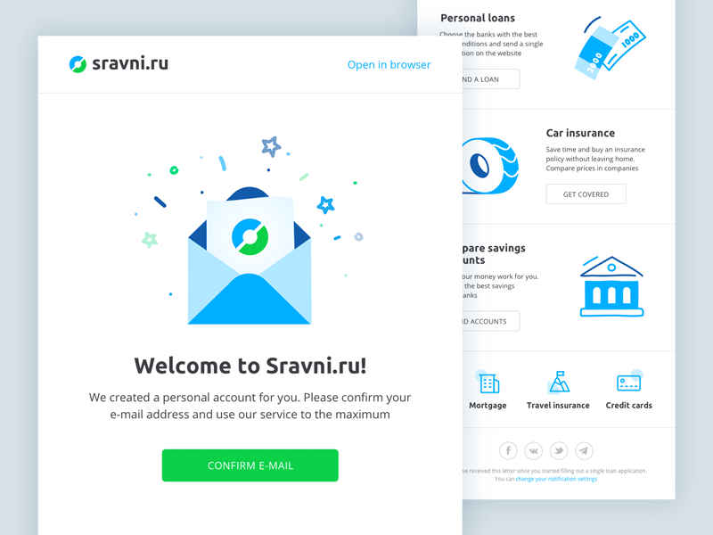
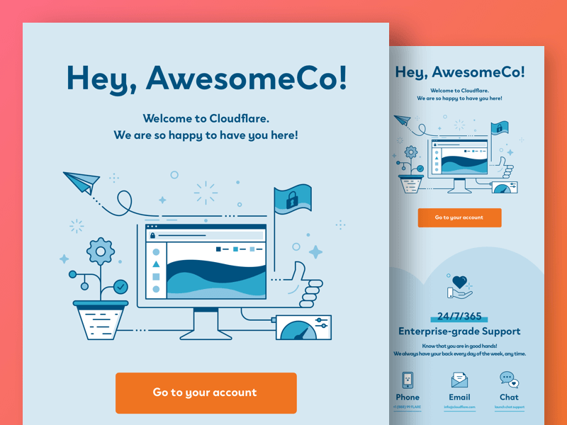
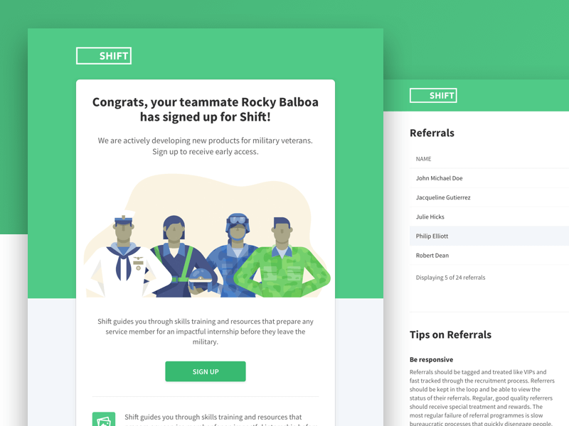
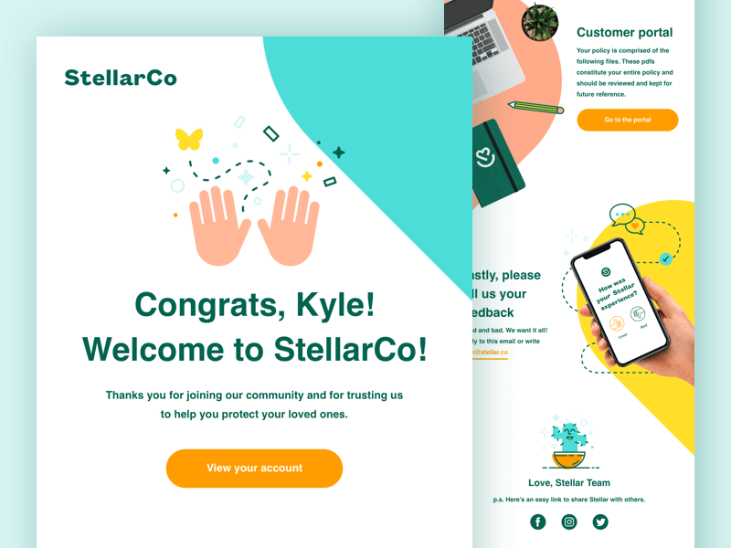

# 前端高质量邮件信实现 ✉


## 背景

最近有做开发邮件信的需求，由于邮件信是显示在邮箱客户端里的html，兼容性有很多问题，发现邮件信的开发中存在很多需要注意的地方在开发过程中收集到的资料整理总结。

## 什么是邮件信

在我们的日常工作中，经常需要发送邮件进行注册确认、营销推广等我们需要发送HTML邮件。由于HTML邮件不存放于自己的服务器，通过邮件服务器来展现，因此编写HTML邮件与编写HTML页面有很大的不同。主流邮箱往往会对它们接收到的HTML邮件在后台进行过滤，JS代码严格过滤掉，包括所有的事件监听属性，如onclick、onmouseover，CSS代码也会被部分过滤这是基于邮件安全性的考虑。


## 低质量邮件信

* 左边是博客园评论通知邮件，
* 右边是某广告邮件信



## 高质量邮件信

* 左边是 `SegmentFault`
* 右边是



## 实现高质量邮件信

### 效果

> `🔗` 在线预览：https://dragonir.github.io/start-html-email/



### 代码

```html
<style type="text/css">
 body, #header h1, #header h2, p {margin: 0; padding: 0;}
 #main {border: 1px solid #cfcece;}
 a {color: #2d95ec;}
 img {display: block;}
 #top-message p, #bottom-message p {color: #3f4042; font-size: 12px; font-family: Arial, Helvetica, sans-serif; }
 #header h1 {color: #ffffff !important; font-family: "Lucida Grande", "Lucida Sans", "Lucida Sans Unicode", sans-serif; font-size: 24px; margin-bottom: 0!important; padding-bottom: 0; }
 #header h2 {color: #ffffff !important; font-family: Arial, Helvetica, sans-serif; font-size: 24px; margin-bottom: 0 !important; padding-bottom: 0; }
 #header p {color: #ffffff !important; font-family: "Lucida Grande", "Lucida Sans", "Lucida Sans Unicode", sans-serif; font-size: 12px;  }
 h1, h2, h3, h4, h5, h6 {margin: 0 0 0.8em 0;}
 h3 {font-size: 28px; color: #444444 !important; font-family: Arial, Helvetica, sans-serif; }
 h4 {font-size: 22px; color: #2d95ec !important; font-family: Arial, Helvetica, sans-serif; }
 h5 {font-size: 18px; color: #444444 !important; font-family: Arial, Helvetica, sans-serif; }
 p {font-size: 12px; color: #444444 !important; font-family: "Lucida Grande", "Lucida Sans", "Lucida Sans Unicode", sans-serif; line-height: 1.5;}
</style>
```

```html
<body>
  <table width="100%" cellpadding="0" cellspacing="0" bgcolor="e4e4e4"><tr><td>
    <table id="top-message" cellpadding="20" cellspacing="0" width="600" align="center">
      <tr>
        <td align="center">
          <p>在邮箱中预览有问题? <a href="#">在浏览器中打开</a></p>
        </td>
      </tr>
    </table><!-- top message -->
    <table id="main" width="600" align="center" cellpadding="0" cellspacing="15" bgcolor="ffffff">
      <tr>
        <td>
          <table id="header" cellpadding="10" cellspacing="0" align="center" bgcolor="8fb3e9">
            <tr>
              <td width="570" bgcolor="2d95ec"><h1>Communitech Venture Services</h1></td>
            </tr>
            <tr>
              <td width="570" bgcolor="2d95ec"><h2 style="color:#ffffff!important">News and Events</h2></td>
            </tr>
            <tr>
              <td width="570" align="right" bgcolor="2d95ec"><p>October 2021</p></td>
            </tr>
          </table><!-- header -->
        </td>
      </tr><!-- header -->
      <tr>
        <td></td>
      </tr>
      <tr>
        <td>
          <table id="content-1" cellpadding="0" cellspacing="0" align="center">
            <tr>
              <td width="170" valign="top">
                <table cellpadding="5" cellspacing="0">
                  <tr><td bgcolor="ffffff"></td></tr></table>
              </td>
              <td width="15"></td>
              <td width="375" valign="top" colspan="3">
                <h3>All New Site Design</h3>
                <h4>It's 150% Better and 40% More Efficient!</h4>
              </td>
            </tr>
          </table><!-- content 1 -->
        </td>
      </tr><!-- content 1 -->
      <tr>
        <td>
          <table id="content-2" cellpadding="0" cellspacing="0" align="center">
            <tr>
              <td width="570"><p>Lorem ipsum dolor sit amet, consectetur adipisicing elit, sed do eiusmod tempor incididunt ut labore et dolore magna aliqua. Ut enim ad minim veniam, quis nostrud exercitation ullamco laboris nisi ut aliquip ex ea commodo consequat. Duis aute irure dolor in reprehenderit in voluptate velit esse cillum dolore eu fugiat nulla pariatur. Excepteur sint occaecat cupidatat non proident, sunt in culpa qui officia deserunt mollit anim id est laborum.</p></td>
            </tr>
          </table><!-- content-2 -->
        </td>
      </tr><!-- content-2 -->
      <tr>
        <td height="30"></td>
      </tr>

      <!-- ... -->

      <tr>
        <td>
          <table id="content-6" cellpadding="0" cellspacing="0" align="center">
            <p align="center">Lorem ipsum dolor sit amet, consectetur adipisicing elit, sed do eiusmod tempor incididunt ut labore et dolore magna aliqua. Ut enim ad minim veniam, quis nostrud exercitation ullamco laboris nisi ut aliquip ex ea commodo consequat. </p>
            <p align="center"><a href="#">CALL TO ACTION</a></p>
          </table>
        </td>
      </tr><!-- content-6 -->
    </table><!-- main -->
    <table id="bottom-message" cellpadding="20" cellspacing="0" width="600" align="center">
      <tr>
        <td align="center">
          <p>之所以您会收到该邮件📧，是因为您已经在我们网站订阅了更新消息！</p>
          <p><a href="#">取消订阅</a> | <a href="#">推荐给好友</a> | <a href="#">在浏览器中查看</a></p>
        </td>
      </tr>
    </table><!-- top message -->
  </td></tr></table><!-- wrapper -->
</body>
```

> `🔗` 完整代码：https://github.com/dragonir/start-html-email

## 测试高质量邮件信

网易邮箱


## 高质量邮件信代码编写原则


1. **页面宽度**：推荐 `600px` - `800px`，最大不要超过 `800px`。
2. **页面布局**：制作 `email`页面时，不要使用 `css+div` 来布局，使用 `table` 来布局。
3. **样式**：定义文字或图片样式时，不要使用外链 `css` 样式，正确的做法请将样式书写在 `<td>` 或 `<font>` 里。

```html
<td style=”font-family:Arial; font-size:12px; color:#000000;” >text</td>
<font style=”font-family:Arial; font-size:12px; color:#000000;” >text</font> <!-- 已废弃 -->
```
> 外链的 `css` 样式在邮件里将不能被读取，发送出去的邮件会失去样式。

4. **动态内容**：不使用 `Flash`、`Java`、`Javascript`、`frames`、`i-frames`、`ActiveX` 以及 `DHTML`，如果页面中的图片一定要是动态的，请使用 `GIF` 动图。
5. **标签**：`<table>` 以外的 `body`、`meta` 和 `html` 之类的标签是可以无视的，邮箱系统里会把这些过滤掉。
6. **背景图片**：有背景图时，`style` 内容里面 `background` 可以设置 `color`，但是 `img` 会被过滤，就是说不能通过 `css` 来设置背景图片。但可以直接写在代码里。如：

```html
<table background=”background.gif” cellspacing=”0″ cellpadding=”0″>
```

> 在 `outlook` 中查看邮件时背景图片不显示，同时，背景图需要用绝对地址。

7. **列表样式**：如果文字内容是写在 `<li>` 里，样式尽量写在 `<ul>` 里，在`sohu`中写在`<td>`或`<tr>`里的样式会被过滤，其它邮箱没有问题。例如：

```html
<ul style=”font-family:宋体; font-size:12px; color:#000000;”>
  <li>你的文字</li>
</ul>
```

8. 在同一个里最好只放一个图片。如,所有的图片都要定义高和宽。这点很关键。图片必须设定高宽，关键图片alt=”…” 属性要写得很清楚，不要使用背景图片。写alt属性是让浏览器在图片未被显示前提示图片内容。不使用背景图片是防止部分web邮箱和客户端对背景图片进行过滤，例如Qq邮箱中的背景图片会随窗口的大小变化而产生移动，而outlook2007干脆就过滤了背景图片。
9. 邮件内容里不要出现鼠标经过的事件”onMouseOut” “onMouseOver”，即使在里设置了，发送到邮箱后也将被过滤，将不能显示设定鼠标经过所显示的内容。
10. 同一段文字请尽可能放在同一里。如果有3段文字，千万不要用回车换行。那样会导致代码里自动加入。这个标签会导致双倍行高。
11. 制作一份和邮件内容一样的web页面，然后在邮件顶部写一句话：“如果您无法查看邮件内容，请点击这里查看”，链到放有同样内容的web页面，这样即使用户收到的邮件图片无法浏览，通过链接也能正常查看内容；
12. HTML代码和图片尽量不要超过50kb（各个邮箱的收件标准不一样，如果超出50kb您的邮件很有可能会进入垃圾邮件箱里）。
13. 邮件模板内的图片地址请不要写成本地路径，例如：

```html
，
```
（这样发送出去的邮件，收件人将没办法看到您的图片）；正确的写法请写成：

```html

```

14. 邮件模板内的所有超链接请写成绝对地址，例如：翰林院网络营销；（以确保收信人在点击超链接时能够正常浏览您的内容）。
15. 在样式中，可以省略font-family属性，但如果font-family：后属性为空，会被QQ屏蔽为垃圾邮件。
16. 在制作HTML邮件内容时，请尽量保持您的链接数量不要超过10个，如果同一模板内所有图片的链接地址一样，请将所有的小图拼和成一张大图加链接。
17. 制作模板时，希望邮件内容全部左右居中显示的话，请在设定table里的width=”100%”，而不要使用设定居中。
18. 设定邮件主题时，请不要在主题中加入带有网站地址的信息，比如“exxx.com祝您新年好”。那样只会进垃圾邮箱！
19. 页面的文字中不要出现网址，例如： http://www.hanlinweb.com，此类文字即使加了超链接，被屏蔽为垃圾邮件的风险也是及高的。
20. 书写标题时，在中文输入法下输入的标点符号在21CN中标题会显示乱码，请大家尽量将标点符号转化成英文输入法下的标点符号。
21. 如没有特殊要求，图片的文件名称一律使用小写
22. 不要在邮件中使用高度过小的图片，outlook2007不能很好的显示高度为1像素的图片，会出现拼合缝隙
23. 在切图时，需要为文字区域留出一定的边距（5px左右，视行数和字数的多少调整），由于outlook中默认行间距和字间距大于普通网页，预留边距可以防止出现不必要的换行和图片缝隙。
24. 因hotmail信箱的接收问题，段落之间不要用< p >标记，用< br >代替。由于Gmail的兼容性问题，假如td里有文字，如要定义该文字样式，必须在td里写style来定义字体，另外td内样式最好也加上这个style=”word-break:break-all;”，其作用在于不会让表格撑开，会自动换行(对IE5.5有效)
25. Tom邮箱的排版问题：在代码中尽量不要使用span标签，使用其他标签替代，可以参考模板中“小提醒”部分的代码写法
26. 字体大小会发生变化，排版出现异常：使用table来排版，每个部分的样式用内联样式写法style=”…” ，例如：

```html
<td style=”font-size:12px; color:#000000;”>
  <a href=”http://www.hanlinweb.com”style=” color:#FFFFFF;”>文字</a>
</td>
```

这种写法使样式能准确的作用到每个 `html` 元素，防止部分web客户端过滤全局样式或者因同名样式引起的问题。其实这是每个edm制作方法中都会提到的问题，只是刚开始做edm的人大多都有偷懒的心态，事实证明这个懒偷不得
	27. sohu的邮箱很怪异，会在每个文本段后面加一个空格，导致原本正常的排版一行放不下而换行，从而使某些布局错乱。所以，如果你要兼容sohu邮箱的话，遇到一些紧凑的布局就要格外小心了，尽量减少文本段的数量，留足宽度。
	28. 对于纯文本邮件：
	• 邮件标题不要超过18个字；
	• 每行不要超过34个字。
	• 对于HTML邮件：
	• 邮件标题不要超过18个字；
	• HTML代码和图片尽量不要超过50kb；
	• 页面宽度推荐650px，最大不要超过800px。

## 附录


### 图片屏蔽

由于图片可以用来侦测邮件的打开率和email地址的有效性。
不少邮件客户端都会默认把邮件中的图片屏蔽，用户需要再点一下才能显示图片。

| Blocking Issue                                              | AOL | Gmail | Hotmail | Yahoo! | Outlook 2000/XP | Outlook 2003 | Outlook Express w/SP2 | Outlook Express w/o SP2 |
| ----------------------------------------------------------- | -------------- | ----- | ------- | ------ | --------------- | ------------ | --------------------- | ----------------------- |
| 外链的图片是否默认被屏蔽                        | ✔            | ✔   | ✘      | ✘     | ✘              | ✔          | ✔                   | ✘                      |
| 用户能否设置是否屏蔽图片                        | ✔            | ✘    | ✔     | ✔    | ✔             | ✔          | ✔                   | ✔                     |
| 能不能让用户点击某个按钮就显示邮件中的图片 | ✔            | ✔   | ✔     | ✘     | ✘              | ✔          | ✔                   | ◯                     |
| 当发件人在用户的联系人列表里时是否默认显示图片 | ✔            | ✘    | ✔     | ✘     | ✔             | ✔          | ✔                   | ✔                     |
| 发件人在ISP白名单中时能不能默认显示图片(国内好像没这个概念) | ✔            | ◯   | ✔     | ✘     | ◯             | ◯          | ◯                   | ◯                     |
| 图片被屏蔽时是否显示alt属性                     | ✘             | ✔   | ✘      | ✘     | ✘              | ✘           | ✘                    | ◯                     |
| 预览时显示windows的主题样式                       | ✘             | ✘    | ✘      | ✘     | ✔             | ✔          | ✔                   | ✔                     |
|                                                             |                |       |         |        |                 |              |                       |                         |

一旦图片被屏蔽，整个邮件就会变得面目全非，重申：
* 重要内容尽量避免使用图片，比如标题、链接等；
* 制作一份和邮件内容一样的web页面，然后在邮件顶部写一句话，类似：“如果您无法查看邮件内容，请点击这里查看”；
* 所有图片都要加上alt属性；
* 所有的图片都要定义高和宽；

### Email客户端的CSS支持情况

#### `<style>` 标签

|                       | gmail | Hotmail | Yahoo | Live Mail | Outlook/OE | AOL | Lotus Notes | Thunderbird | Mac Email | Entourage | Eudora |
| --------------------- | ----- | ------- | ----- | --------- | ---------- | --- | ----------- | ----------- | --------- | --------- | ------ |
| `<head>`中的`<style>`标签 | ✘    | ✘      | ✔   | ✔       | ✔        | ✔ | ✘          | ✔         | ✔       | ✔       | ✘     |
| `<body>`中的`<style>`标签 | ✘    | ✔     | ✔   | ✔       | ✔        | ✔ | ✘          | ✔         | ✔       | ✔       | ✘     |

#### `<link>` 标签

|                       | gmail | Hotmail | Yahoo | Live Mail | Outlook/OE | AOL | Lotus Notes | Thunderbird | Mac Email | Entourage | Eudora |
| --------------------- | ----- | ------- | ----- | --------- | ---------- | --- | ----------- | ----------- | --------- | --------- | ------ |
| `<head>`中的`<style>`标签 | ✘    | ✘      | ✔   | ✔       | ✔        | ✔ | ✘          | ✔         | ✔       | ✔       | ✘     |
| `<body>`中的`<style>`标签 | ✘    | ✔     | ✔   | ✔       | ✔        | ✔ | ✘          | ✔         | ✔       | ✔       | ✘     |

#### CSS 选择器

|                  | gmail | Hotmail | Yahoo | Live Mail | Outlook/OE | AOL | Lotus Notes | Thunderbird | Mac Email | Entourage | Eudora |
| ---------------- | ----- | ------- | ----- | --------- | ---------- | --- | ----------- | ----------- | --------- | --------- | ------ |
| *                | ✘    | ✘      | ✘    | ✘        | ✔        | ✔ | ✔         | ✔         | ✔       | ✔       | ✘     |
| e                | ✘    | ✘      | ✘    | ✘        | ✔        | ✔ | ✔         | ✔         | ✔       | ✔       | ✘     |
| e > f            | ✘    | ✘      | ✔   | ✘        | ✘         | ✘  | ✘          | ✔         | ✔       | ✔       | ✘     |
| e:link           | ✘    | ✔     | ✔   | ✔       | ✔        | ✔ | ✘          | ✔         | ✔       | ✔       | ✘     |
| e:active,e:hover | ✘    | ✔     | ✔   | ✔       | ✔        | ✔ | ✘          | ✔         | ✔       | ✔       | ✘     |
| e:focus          | ✘    | ✘      | ✔   | ✘        | ✘         | ✘  | ✘          | ✔         | ✔       | ✔       | ✘     |
| e + f            | ✘    | ✔     | ✔   | ✘        | ✘         | ✘  | ✘          | ✔         | ✔       | ✘        | ✘     |
| `e [foo]`          | ✘    | ✔     | ✔   | ✘        | ✘         | ✘  | ✘          | ✔         | ✔       | ✘        | ✘     |
| e.className      | ✘    | ✔     | ✔   | ✔       | ✔        | ✔ | ✘          | ✔         | ✔       | ✔       | ✘     |
| e#id             | ✘    | ✔     | ✔   | ✔       | ✔        | ✔ | ✘          | ✔         | ✔       | ✔       | ✘     |
| e:first-line     | ✘    | ✔     | ✔   | ✔       | ✔        | ✔ | ✘          | ✔         | ✔       | ✔       | ✘     |
| e:first-letter   | ✘    | ✔     | ✔   | ✔       | ✔        | ✔ | ✘          | ✔         | ✔       | ✔       | ✘     |

#### CSS 属性

|                     | gmail | Hotmail  | Yahoo | Live Mail | Outlook/OE | AOL | Lotus Notes | Thunderbird | Mac Email | Entourage | Eudora |
| ------------------- | ----- | -------- | ----- | --------- | ---------- | --- | ----------- | ----------- | --------- | --------- | ------ |
| background-color    | ✔   | ✔      | ✔   | ✔       | ✔        | ✔ | ✘          | ✔         | ✔       | ✔       | ✘     |
| background-image    | ✘    | ✔ | ✔   | ✘        | ✔ *      | ✔ | ✔         | ✔         | ✔       | ✔       | ✘     |
| background-position | ✘    | ✘       | ✘    | ✘        | ✔ *      | ✔ | ✘          | ✔         | ✔       | ✔       | ✘     |
| background-repeat   | ✘    | ✔      | ✔   | ✘        | ✔ *      | ✔ | ✘          | ✔         | ✔       | ✔       | ✘     |
| border              | ✔   | ✔      | ✔   | ✔       | ✔        | ✔ | ✘          | ✔         | ✔       | ✔       | ✘     |
| border-collapse     | ✔   | ✔      | ✔   | ✔       | ✔        | ✔ | ✘          | ✔         | ✔       | ✘        | ✘     |
| border-spacing      | ✔   | ✘       | ✔   | ✘        | ✘         | ✘  | ✘          | ✔         | ✔       | ✘        | ✘     |
| bottom              | ✘    | ✔      | ✔   | ✘        | ✔        | ✔ | ✘          | ✔         | ✔       | ✔       | ✘     |
| caption-side        | ✔   | ✘       | ✔   | ✘        | ✘         | ✘  | ✘          | ✔         | ✘        | ✘        | ✘     |
| clip                | ✘    | ✔      | ✔   | ✘        | ✔        | ✔ | ✘          | ✔         | ✔       | ✔       | ✘     |
| color               | ✔   | ✔      | ✔   | ✔       | ✔        | ✔ | ✔         | ✔         | ✔       | ✔       | ✘     |
| cursor              | ✘    | ✔      | ✔   | ✔       | ✔        | ✔ | ✘          | ✔         | ✔       | ✘        | ✘     |
| direction           | ✔   | ✔      | ✔   | ✔       | ✔        | ✔ | ✔         | ✔         | ✔       | ✘        | ✘     |
| display             | ✘    | ✔      | ✔   | ✔       | ✔        | ✔ | ✔         | ✔         | ✔       | ✘        | ✘     |
| empty-cells         | ✔   | ✘       | ✔   | ✘        | ✘         | ✘  | ✘          | ✔         | ✔       | ✘        | ✘     |
| filter              | ✘    | ✘       | ✔   | ✔       | ✘         | ✘  | ✘          | ✘          | ✘        | ✘        | ✘     |
| float               | ✘    | ✔      | ✔   | ✔       | ✔        | ✔ | ✘          | ✔         | ✔       | ✔       | ✘     |
| font-family         | ✘    | ✔      | ✔   | ✔       | ✔        | ✔ | ✔         | ✔         | ✔       | ✔       | ✘     |
| font-size           | ✔   | ✔      | ✔   | ✔       | ✔        | ✔ | ✔         | ✔         | ✔       | ✔       | ✘     |
| font-style          | ✔   | ✔      | ✔   | ✔       | ✔        | ✔ | ✔         | ✔         | ✔       | ✔       | ✘     |
| font-variant        | ✔   | ✔      | ✔   | ✔       | ✔        | ✔ | ✘          | ✔         | ✔       | ✔       | ✘     |
| font-weight         | ✔   | ✔      | ✔   | ✔       | ✔        | ✔ | ✔         | ✔         | ✔       | ✔       | ✘     |
| height              | ✘    | ✔      | ✔   | ✔       | ✔        | ✔ | ✘          | ✔         | ✔       | ✔       | ✘     |
| left                | ✘    | ✔      | ✔   | ✔       | ✔        | ✔ | ✘          | ✔         | ✔       | ✔       | ✘     |
| letter-spacing      | ✔   | ✔      | ✔   | ✔       | ✔        | ✔ | ✘          | ✔         | ✔       | ✔       | ✘     |
| line-height         | ✔   | ✔      | ✔   | ✔       | ✔        | ✔ | ✘          | ✔         | ✔       | ✔       | ✘     |
| list-style-image    | ✘    | ✔      | ✔   | ✘        | ✔        | ✔ | ✘          | ✔         | ✔       | ✔       | ✘     |
| list-style-position | ✔   | ✘       | ✘    | ✔       | ✔        | ✔ | ✘          | ✔         | ✔       | ✔       | ✘     |
| list-style-type     | ✔   | ✘       | ✔   | ✔       | ✔        | ✔ | ✔         | ✔         | ✔       | ✔       | ✘     |
| margin              | ✔   | ✘       | ✔   | ✘        | ✔        | ✔ | ✘          | ✔         | ✔       | ✔       | ✘     |
| opacity             | ✘    | ✘       | ✔   | ✔       | ✘         | ✘  | ✘          | ✔         | ✔       | ✘        | ✘     |
| overflow            | ✔   | ✔      | ✔   | ✔       | ✔        | ✔ | ✘          | ✔         | ✔       | ✔       | ✘     |
| padding             | ✔   | ✔      | ✔   | ✔       | ✔        | ✔ | ✘          | ✔         | ✔       | ✔       | ✘     |
| position            | ✘    | ✘       | ✘    | ✘        | ✔        | ✔ | ✘          | ✔         | ✔       | ✔       | ✘     |
| right               | ✘    | ✔      | ✔   | ✘        | ✔        | ✔ | ✘          | ✔         | ✔       | ✔       | ✘     |
| table-layout        | ✔   | ✔      | ✔   | ✔       | ✔        | ✔ | ✘          | ✔         | ✔       | ✔       | ✘     |
| text-align          | ✔   | ✔      | ✔   | ✔       | ✔        | ✔ | ✔         | ✔         | ✔       | ✔       | ✘     |
| text-decoration     | ✔   | ✔      | ✔   | ✔       | ✔        | ✔ | ✔         | ✔         | ✔       | ✔       | ✘     |
| text-indent         | ✔   | ✔      | ✔   | ✔       | ✔        | ✔ | ✘          | ✔         | ✔       | ✔       | ✘     |
| `text-transform`      | ✔   | ✔      | ✔   | ✔       | ✔        | ✔ | ✘          | ✔         | ✔       | ✔       | ✘     |
| `top`                 | ✘    | ✔      | ✔   | ✘        | ✔        | ✔ | ✘          | ✔         | ✔       | ✔       | ✘     |
| `vertical-align`      | ✔   | ✔      | ✔   | ✔       | ✔        | ✔ | ✘          | ✔         | ✔       | ✔       | ✘     |
| `visibility`          | ✘    | ✔      | ✔   | ✔       | ✔        | ✔ | ✘          | ✔         | ✔       | ✔       | ✘     |
| `white-space`         | ✔   | ✔      | ✔   | ✘        | ✘         | ✘  | ✘          | ✔         | ✔       | ✔       | ✘     |
| `width`               | ✔   | ✔      | ✔   | ✔       | ✔        | ✔ | ✘          | ✔         | ✔       | ✔       | ✘     |
| `word-spacing`        | ✔   | ✔      | ✔   | ✔       | ✔        | ✔ | ✘          | ✔         | ✔       | ✔       | ✘     |
| `z-index`             | ✘    | ✔      | ✔   | ✘        | ✔        | ✔ | ✘          | ✔         | ✔       | ✔       | ✘     |

(*) 不被Microsoft Outlook 2007支持。

## 更多高质量邮件信






## 参考资料

[1]. [dribbble](https://dribbble.com/)
[2]. [Email页面代码书写建议及规范](https://www.cnblogs.com/zhuboxingzbx/articles/1415600.html)