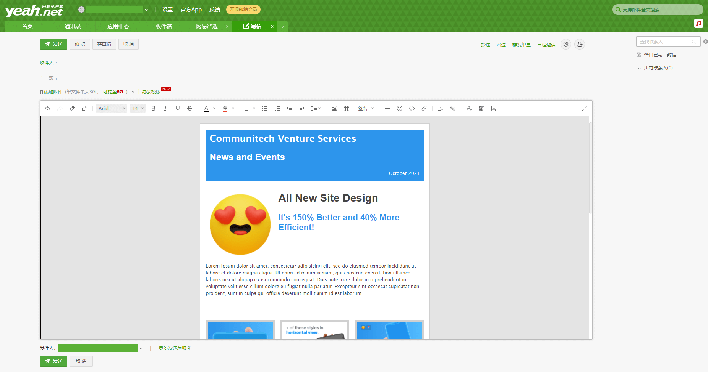

# 实现前端高质量邮件信 ✉


## 背景

最近做了公司产品邀请成员加入发送邮件信的需求，邮件信是显示在各种邮箱客户端里的 `HTML`页面，有很多兼容性问题。本文内容主要是对邮件信开发过程中需要注意的地方的总结、对收集到的邮件信相关资料整理总结、以及对开发高质量邮件信的建议。

## 什么是邮件信

在我们的日常工作中，经常需要发送邮件进行注册确认、营销推广等我们需要发送 `HTML` 邮件，这就是 `邮件信EDM`。由于 `HTML` 邮件不存放于自己的服务器，通过邮件服务器来展现，因此编写HTML邮件与编写 `HTML` 页面有很大的不同。主流邮箱往往会对它们接收到的 `HTML` 邮件在后台进行过滤，对 `JS` 代码进行严格过滤，包括所有的事件监听属性，如 `onclick`、`onmouseover` 等。`CSS` 代码也会被部分过滤。这是基于邮件 `安全性` 的考虑。


## 低质量邮件信 `👎`

* `博客园` 评论通知：虽然简明扼要，但是作为官网发出的邮件，样式缺少权威性，很容易被忽略。
* 某广告邮件：样式排版布局杂乱，一眼就能识别出是垃圾邮件 `🗑`，完全没有仔细阅读的欲望。


## 高质量邮件信 `👍`

* `SegmentFault` 评论通知：同样作为技术博客网站，醒目的主题样式除了突显官方权威性之外，也能达到品牌宣传的作用。
* `Frontend Focus` 订阅邮件：标题、`banner`、 文章列表层次结构分明，使读者能够清晰快速地定位到自己感兴趣的内容，整洁的样式也能吸引更多的读者订阅。


## 实现高质量邮件信

### 效果

> `🔗` 在线预览：https://dragonir.github.io/start-html-email/


### 代码

在 `<style>` 标签中可以添加全局样式代码，大部分邮箱都支持在header标签中添加样式，不过也有可能少数古早的邮件客户端会将这部分样式过滤掉，在这种邮箱客户端中只能通过 `行内样式` 来解决。

```html
<style type="text/css">
 body, #header h1, #header h2, p {margin: 0; padding: 0;}
 #main {border: 1px solid #cfcece;}
 a {color: #2d95ec;}
 img {display: block;}
 #top-message p, #bottom-message p {color: #3f4042; font-size: 12px; font-family: Arial, Helvetica, sans-serif; }
 #header h1 {color: #ffffff !important; font-family: "Lucida Grande", "Lucida Sans", "Lucida Sans Unicode", sans-serif; font-size: 24px; margin-bottom: 0!important; padding-bottom: 0; }
 #header h2 {color: #ffffff !important; font-family: Arial, Helvetica, sans-serif; font-size: 24px; margin-bottom: 0 !important; padding-bottom: 0; }
 #header p {color: #ffffff !important; font-family: "Lucida Grande", "Lucida Sans", "Lucida Sans Unicode", sans-serif; font-size: 12px;  }
 h1, h2, h3, h4, h5, h6 {margin: 0 0 0.8em 0;}
 h3 {font-size: 28px; color: #444444 !important; font-family: Arial, Helvetica, sans-serif; }
 h4 {font-size: 22px; color: #2d95ec !important; font-family: Arial, Helvetica, sans-serif; }
 h5 {font-size: 18px; color: #444444 !important; font-family: Arial, Helvetica, sans-serif; }
 p {font-size: 12px; color: #444444 !important; font-family: "Lucida Grande", "Lucida Sans", "Lucida Sans Unicode", sans-serif; line-height: 1.5; }
</style>
```

```html
<body>
  <table width="100%" cellpadding="0" cellspacing="0" bgcolor="e4e4e4"><tr><td>
    <table id="top-message" cellpadding="20" cellspacing="0" width="600" align="center">
      <tr>
        <td align="center">
          <p>在邮箱中预览有问题? <a href="#">在浏览器中打开</a></p>
        </td>
      </tr>
    </table><!-- top message -->
    <table id="main" width="600" align="center" cellpadding="0" cellspacing="15" bgcolor="ffffff">
      <tr>
        <td>
          <table id="header" cellpadding="10" cellspacing="0" align="center" bgcolor="8fb3e9">
            <tr>
              <td width="570" bgcolor="2d95ec"><h1>Communitech Venture Services</h1></td>
            </tr>
            <tr>
              <td width="570" bgcolor="2d95ec"><h2 style="color:#ffffff!important">News and Events</h2></td>
            </tr>
            <tr>
              <td width="570" align="right" bgcolor="2d95ec"><p>October 2021</p></td>
            </tr>
          </table><!-- header -->
        </td>
      </tr><!-- header -->
      <tr>
        <td></td>
      </tr>
      <tr>
        <td>
          <table id="content-1" cellpadding="0" cellspacing="0" align="center">
            <tr>
              <td width="170" valign="top">
                <table cellpadding="5" cellspacing="0">
                  <tr><td bgcolor="ffffff"></td></tr></table>
              </td>
              <td width="15"></td>
              <td width="375" valign="top" colspan="3">
                <h3>All New Site Design</h3>
                <h4>It's 150% Better and 40% More Efficient!</h4>
              </td>
            </tr>
          </table><!-- content 1 -->
        </td>
      </tr><!-- content 1 -->
      <tr>
        <td>
          <table id="content-2" cellpadding="0" cellspacing="0" align="center">
            <tr>
              <td width="570"><p>Lorem ipsum dolor sit amet, consectetur adipisicing elit, sed do eiusmod tempor incididunt ut labore et dolore magna aliqua. Ut enim ad minim veniam, quis nostrud exercitation ullamco laboris nisi ut aliquip ex ea commodo consequat. Duis aute irure dolor in reprehenderit in voluptate velit esse cillum dolore eu fugiat nulla pariatur. Excepteur sint occaecat cupidatat non proident, sunt in culpa qui officia deserunt mollit anim id est laborum.</p></td>
            </tr>
          </table><!-- content-2 -->
        </td>
      </tr><!-- content-2 -->
      <tr>
        <td height="30"></td>
      </tr>

      <!-- ... -->

      <tr>
        <td>
          <table id="content-6" cellpadding="0" cellspacing="0" align="center">
            <p align="center">Lorem ipsum dolor sit amet, consectetur adipisicing elit, sed do eiusmod tempor incididunt ut labore et dolore magna aliqua. Ut enim ad minim veniam, quis nostrud exercitation ullamco laboris nisi ut aliquip ex ea commodo consequat. </p>
            <p align="center"><a href="#">CALL TO ACTION</a></p>
          </table>
        </td>
      </tr><!-- content-6 -->
    </table><!-- main -->
    <table id="bottom-message" cellpadding="20" cellspacing="0" width="600" align="center">
      <tr>
        <td align="center">
          <p>之所以您会收到该邮件📧，是因为您已经在我们网站订阅了更新消息！</p>
          <p><a href="#">取消订阅</a> | <a href="#">推荐给好友</a> | <a href="#">在浏览器中查看</a></p>
        </td>
      </tr>
    </table><!-- top message -->
  </td></tr></table><!-- wrapper -->
</body>
```

> `🔗` 完整代码：https://github.com/dragonir/start-html-email

## 测试高质量邮件信

网易邮箱、QQ邮箱（有功能，但我上传时接口会报错）、189邮箱（已去除该功能）



## 高质量邮件信代码编写原则

1. **页面宽度**：推荐 `600px` - `800px`，最大不要超过 `800px`。

2. **页面布局**：制作 `email`页面时，不要使用 `css+div` 来布局，使用 `table` 来布局。

3. **样式**：定义文字或图片样式时，不要使用外链 `css` 样式，正确的做法请将样式书写在 `<td>` 或 `<font>` 里。

```html
<td style=”font-family:Arial; font-size:12px; color:#000000;” >text</td>
<font style=”font-family:Arial; font-size:12px; color:#000000;” >text</font> <!-- 已废弃 -->
```
> `💡` 外链的 `css` 样式在邮件里将不能被读取，发送出去的邮件会失去样式。

4. **动态内容**：不使用 `Flash`、`Java`、`Javascript`、`frames`、`i-frames`、`ActiveX` 以及 `DHTML`，如果页面中的图片一定要是动态的，请使用 `GIF` 动图。

5. **标签**：`<table>` 以外的 `body`、`meta` 和 `html` 之类的标签是可以无视的，邮箱系统里会把这些过滤掉。

6. **背景图片**：有背景图时，`style` 内容里面 `background` 可以设置 `color`，但是 `img` 会被过滤，就是说不能通过 `css` 来设置背景图片。但可以直接写在代码里。如：

```html
<table background=”background.gif” cellspacing=”0″ cellpadding=”0″>
```

> `💡` 在 `outlook` 中查看邮件时背景图片不显示，同时，背景图需要用绝对地址。

7. **列表样式**：如果文字内容是写在 `<li>` 里，样式尽量写在 `<ul>` 里，在`sohu` 邮箱中写在 `<td>` 或 `<tr>` 里的样式会被过滤，其它邮箱没有问题。

8. **`img` 元素设置宽高**：所有的图片都要设置 `height` 和 `width`。这点很关键。关键图片要添加 `alt` 属性。

> `💡` `alt` 属性是让邮件在图片未加载完成前提示图片内容。

9. **不要设置鼠标事件**：不要在邮件内容中设置鼠标经过事件如 `onMouseOut`，`onMouseOver`，发送到邮箱后会被过滤，将不能正确显示设定鼠标经过所显示的内容。

10. **不要回车换行**：同一段文字请尽可能放在同一元素里。如果有多段文字，千万不要用回车换行，这样会导致邮件中自动换行符导致该标签双倍行高。

11. **添加可替代网页**：制作一份和邮件内容一样的 `WEB` 页面，然后在邮件顶部提示链接 `如果您无法查看邮件内容，请点击这里查看`。这样即使邮箱客户端内异常，通过链接也能查看正确内容。

12. **压缩体积**：`HTML` 代码和图片尽量不要超过 `50kb`。

> `💡` 各个邮箱的收件标准不同，有些邮箱超过 `50kb` 会被识别为垃圾邮件。示例中，为了展示效果，是我随便找的图片，体积比较大 `😂`。

13. **限制图片数量**：在制作 `HTML` 邮件内容时，链接数量尽量保持在 `10` 个以内，如果同一模板内所有图片的链接地址一样，可以将所有小图拼成一张大图使用。

14. **使用绝对路径**：邮件模板内的所有超链接使用绝对地址，以确保收信人在点击超链接时能够正常浏览内容。

15. **`font-family` 属性可以省略**：`font-family` 属性是非必要的，如果有 `font-family`且值为空，会被 `QQ邮箱` 屏蔽为垃圾邮件。

16. **居中显示**：制作模板时，如果希望邮件内容全部左右居中显示的话，需要将 `table` 的 `width` 设为 `100%`。

17. **避免在邮件中直接显示网址**：页面的文字中不要出现网址，会被有些邮箱被屏蔽为垃圾邮件，网站可以写在 `a` 标签中。

18. **文件名称小写**：如没有特殊要求，图片的文件名称一律使用小写。

19. **避免使用尺寸过小图片**：不要在邮件中使用高度过小的图片，`outlook2007` 不能很好的显示高度为1像素的图片，会出现拼合缝隙

20. **可以将边距留在切图中**：在切图时，可以为需要为文字区域留出一定的边距，由于 `outlook` 中默认行间距和字间距大于普通网页，预留边距可以防止出现不必要的换行和图片缝隙。

21. **使用 `<br>` 换行**：因 `hotmail` 信箱的接收问题，段落之间不要用 `<p>` 标记，用 `<br>` 代替。

22. **推荐行内样式**：由于 `Gmail` 的兼容性问题，假如td里有文字，如要定义该文字样式，必须在 `td` 里写 `style` 行内样式来定义字体。

23. **使用强制换行**：`td` 内样式最好加上 `style=”word-break:break-all;`，其作用在于不会让表格撑开，会强制折断文本换行。

24. **纯文本邮件**：邮件标题不要超过 `18` 个字、每行不要超过 `34` 个字。

## 附录

下面内容罗列了一些国外邮箱客户端对 `html` 标签和 `css` 属性的支持度。根据开发经验，一般兼容 `outlook` 邮箱的邮件信，必定是兼容国内邮箱的。


### 图片屏蔽

由于图片可以用来侦测邮件的打开率和 `email` 地址的有效性。不少邮件客户端都会默认把邮件中的图片屏蔽，用户需要再点一下才能显示图片。

| Blocking Issue                                              | AOL | Gmail | Hotmail | Yahoo! | Outlook 2000/XP | Outlook 2003 | Outlook Express w/SP2 | Outlook Express w/o SP2 |
| ----------------------------------------------------------- | -------------- | ----- | ------- | ------ | --------------- | ------------ | --------------------- | ----------------------- |
| 外链图片是否默认被屏蔽                        | ✔            | ✔   | ❌      | ❌     | ❌              | ✔          | ✔                   | ❌                      |
| 用户能否设置是否屏蔽图片                        | ✔            | ❌    | ✔     | ✔    | ✔             | ✔          | ✔                   | ✔                     |
| 能否让用户点击某个按钮就显示邮件中的图片 | ✔            | ✔   | ✔     | ❌     | ❌              | ✔          | ✔                   | ◯                     |
| 发件人在用户联系人列表时是否默认显示图片 | ✔            | ❌    | ✔     | ❌     | ✔             | ✔          | ✔                   | ✔                     |
| 发件人在ISP白名单中时能否默认显示图片 | ✔            | ◯   | ✔     | ❌     | ◯             | ◯          | ◯                   | ◯                     |
| 图片被屏蔽时是否显示alt属性                     | ❌             | ✔   | ❌      | ❌     | ❌              | ❌           | ❌                    | ◯                     |
| 预览时显示windows的主题样式                       | ❌             | ❌    | ❌      | ❌     | ✔             | ✔          | ✔                   | ✔                     |
|                                                             |                |       |         |        |                 |              |                       |                         |

### 邮箱客户端对 `CSS` 的支持情况

#### `<style>` 标签

|                       | gmail | Hotmail | Yahoo | Live Mail | Outlook/OE | AOL | Lotus Notes | Thunderbird | Mac Email | Entourage | Eudora |
| --------------------- | ----- | ------- | ----- | --------- | ---------- | --- | ----------- | ----------- | --------- | --------- | ------ |
| `<head>`中的`<style>`标签 | ❌    | ❌      | ✔   | ✔       | ✔        | ✔ | ❌          | ✔         | ✔       | ✔       | ❌     |
| `<body>`中的`<style>`标签 | ❌    | ✔     | ✔   | ✔       | ✔        | ✔ | ❌          | ✔         | ✔       | ✔       | ❌     |

#### `<link>` 标签

|                      | gmail | Hotmail | Yahoo | Live Mail | Outlook/OE | AOL | Lotus Notes | Thunderbird | Mac Email | Entourage | Eudora |
| -------------------- | ----- | ------- | ----- | --------- | ---------- | --- | ----------- | ----------- | --------- | --------- | ------ |
| `<head>`中的`<link>`标签 | ❌   | ❌      | ❌    | ❌        | ✔        | ✔ | ✔         | ✔         | ✔       | ✔       | ❌     |
| `<body>`中的`<link>`标签 | ❌    | ❌      | ❌    | ❌        | ✔        | ✔ | ✔         | ✔         | ✔       | ✔       | ❌     |

#### CSS 选择器

|                  | gmail | Hotmail | Yahoo | Live Mail | Outlook/OE | AOL | Lotus Notes | Thunderbird | Mac Email | Entourage | Eudora |
| ---------------- | ----- | ------- | ----- | --------- | ---------- | --- | ----------- | ----------- | --------- | --------- | ------ |
| `*`                | ❌    | ❌      | ❌    | ❌        | ✔        | ✔ | ✔         | ✔         | ✔       | ✔       | ❌     |
| `e`                | ❌    | ❌      | ❌    | ❌        | ✔        | ✔ | ✔         | ✔         | ✔       | ✔       | ❌     |
| `e > f`            | ❌    | ❌      | ✔   | ❌        | ❌         | ❌  | ❌          | ✔         | ✔       | ✔       | ❌     |
| `e:link`           | ❌    | ✔     | ✔   | ✔       | ✔        | ✔ | ❌          | ✔         | ✔       | ✔       | ❌     |
| `e:active,e:hover` | ❌    | ✔     | ✔   | ✔       | ✔        | ✔ | ❌          | ✔         | ✔       | ✔       | ❌     |
| `e:focus`          | ❌    | ❌      | ✔   | ❌        | ❌         | ❌  | ❌          | ✔         | ✔       | ✔       | ❌     |
| `e + f`            | ❌    | ✔     | ✔   | ❌        | ❌         | ❌  | ❌          | ✔         | ✔       | ❌        | ❌     |
| `e [foo]`          | ❌    | ✔     | ✔   | ❌        | ❌         | ❌  | ❌          | ✔         | ✔       | ❌        | ❌     |
| `e.className`      | ❌    | ✔     | ✔   | ✔       | ✔        | ✔ | ❌          | ✔         | ✔       | ✔       | ❌     |
| `e#id`             | ❌    | ✔     | ✔   | ✔       | ✔        | ✔ | ❌          | ✔         | ✔       | ✔       | ❌     |
| `e:first-line`     | ❌    | ✔     | ✔   | ✔       | ✔        | ✔ | ❌          | ✔         | ✔       | ✔       | ❌     |
| `e:first-letter`   | ❌    | ✔     | ✔   | ✔       | ✔        | ✔ | ❌          | ✔         | ✔       | ✔       | ❌     |

#### CSS 属性

|                     | gmail | Hotmail  | Yahoo | Live Mail | Outlook/OE | AOL | Lotus Notes | Thunderbird | Mac Email | Entourage | Eudora |
| ------------------- | ----- | -------- | ----- | --------- | ---------- | --- | ----------- | ----------- | --------- | --------- | ------ |
| `background-color`    | ✔   | ✔      | ✔   | ✔       | ✔        | ✔ | ❌          | ✔         | ✔       | ✔       | ❌     |
| `background-image`    | ❌    | ✔ | ✔   | ❌        | ✔ *      | ✔ | ✔         | ✔         | ✔       | ✔       | ❌     |
| `background-position` | ❌    | ❌       | ❌    | ❌        | ✔ *      | ✔ | ❌          | ✔         | ✔       | ✔       | ❌     |
| `background-repeat`   | ❌    | ✔      | ✔   | ❌        | ✔ *      | ✔ | ❌          | ✔         | ✔       | ✔       | ❌     |
| `border`              | ✔   | ✔      | ✔   | ✔       | ✔        | ✔ | ❌          | ✔         | ✔       | ✔       | ❌     |
| `border-collapse`     | ✔   | ✔      | ✔   | ✔       | ✔        | ✔ | ❌          | ✔         | ✔       | ❌        | ❌     |
| `border-spacing`      | ✔   | ❌       | ✔   | ❌        | ❌         | ❌  | ❌          | ✔         | ✔       | ❌        | ❌     |
| `bottom`              | ❌    | ✔      | ✔   | ❌        | ✔        | ✔ | ❌          | ✔         | ✔       | ✔       | ❌     |
| `caption-side`        | ✔   | ❌       | ✔   | ❌        | ❌         | ❌  | ❌          | ✔         | ❌        | ❌        | ❌     |
| `clip`               | ❌    | ✔      | ✔   | ❌        | ✔        | ✔ | ❌          | ✔         | ✔       | ✔       | ❌     |
| `color`               | ✔   | ✔      | ✔   | ✔       | ✔        | ✔ | ✔         | ✔         | ✔       | ✔       | ❌     |
| `cursor`              | ❌    | ✔      | ✔   | ✔       | ✔        | ✔ | ❌          | ✔         | ✔       | ❌        | ❌     |
| `direction`           | ✔   | ✔      | ✔   | ✔       | ✔        | ✔ | ✔         | ✔         | ✔       | ❌        | ❌     |
| `display`             | ❌    | ✔      | ✔   | ✔       | ✔        | ✔ | ✔         | ✔         | ✔       | ❌        | ❌     |
| `empty-cells`         | ✔   | ❌       | ✔   | ❌        | ❌         | ❌  | ❌          | ✔         | ✔       | ❌        | ❌     |
| `filter`              | ❌    | ❌       | ✔   | ✔       | ❌         | ❌  | ❌          | ❌          | ❌        | ❌        | ❌     |
| `float`               | ❌    | ✔      | ✔   | ✔       | ✔        | ✔ | ❌          | ✔         | ✔       | ✔       | ❌     |
| `font-family`         | ❌    | ✔      | ✔   | ✔       | ✔        | ✔ | ✔         | ✔         | ✔       | ✔       | ❌     |
| `font-size`           | ✔   | ✔      | ✔   | ✔       | ✔        | ✔ | ✔         | ✔         | ✔       | ✔       | ❌     |
| `font-style`          | ✔   | ✔      | ✔   | ✔       | ✔        | ✔ | ✔         | ✔         | ✔       | ✔       | ❌     |
| `font-variant`        | ✔   | ✔      | ✔   | ✔       | ✔        | ✔ | ❌          | ✔         | ✔       | ✔       | ❌     |
| `font-weight`         | ✔   | ✔      | ✔   | ✔       | ✔        | ✔ | ✔         | ✔         | ✔       | ✔       | ❌     |
| `height`              | ❌    | ✔      | ✔   | ✔       | ✔        | ✔ | ❌          | ✔         | ✔       | ✔       | ❌     |
| `left`                | ❌    | ✔      | ✔   | ✔       | ✔        | ✔ | ❌          | ✔         | ✔       | ✔       | ❌     |
| `letter-spacing`      | ✔   | ✔      | ✔   | ✔       | ✔        | ✔ | ❌          | ✔         | ✔       | ✔       | ❌     |
| `line-height`         | ✔   | ✔      | ✔   | ✔       | ✔        | ✔ | ❌          | ✔         | ✔       | ✔       | ❌     |
| `list-style-image`    | ❌    | ✔      | ✔   | ❌        | ✔        | ✔ | ❌          | ✔         | ✔       | ✔       | ❌     |
| `list-style-position` | ✔   | ❌       | ❌    | ✔       | ✔        | ✔ | ❌          | ✔         | ✔       | ✔       | ❌     |
| `list-style-type`     | ✔   | ❌       | ✔   | ✔       | ✔        | ✔ | ✔         | ✔         | ✔       | ✔       | ❌     |
| `margin`              | ✔   | ❌       | ✔   | ❌        | ✔        | ✔ | ❌          | ✔         | ✔       | ✔       | ❌     |
| `opacity`             | ❌    | ❌       | ✔   | ✔       | ❌         | ❌  | ❌          | ✔         | ✔       | ❌        | ❌     |
| `overflow`            | ✔   | ✔      | ✔   | ✔       | ✔        | ✔ | ❌          | ✔         | ✔       | ✔       | ❌     |
| `padding`             | ✔   | ✔      | ✔   | ✔       | ✔        | ✔ | ❌          | ✔         | ✔       | ✔       | ❌     |
| `position`            | ❌    | ❌       | ❌    | ❌        | ✔        | ✔ | ❌          | ✔         | ✔       | ✔       | ❌     |
| `right`               | ❌    | ✔      | ✔   | ❌        | ✔        | ✔ | ❌          | ✔         | ✔       | ✔       | ❌     |
| `table-layout`        | ✔   | ✔      | ✔   | ✔       | ✔        | ✔ | ❌          | ✔         | ✔       | ✔       | ❌     |
| `text-align`          | ✔   | ✔      | ✔   | ✔       | ✔        | ✔ | ✔         | ✔         | ✔       | ✔       | ❌     |
| `text-decoration`     | ✔   | ✔      | ✔   | ✔       | ✔        | ✔ | ✔         | ✔         | ✔       | ✔       | ❌     |
| `text-indent`         | ✔   | ✔      | ✔   | ✔       | ✔        | ✔ | ❌          | ✔         | ✔       | ✔       | ❌     |
| `text-transform`      | ✔   | ✔      | ✔   | ✔       | ✔        | ✔ | ❌          | ✔         | ✔       | ✔       | ❌     |
| `top`                 | ❌    | ✔      | ✔   | ❌        | ✔        | ✔ | ❌          | ✔         | ✔       | ✔       | ❌     |
| `vertical-align`      | ✔   | ✔      | ✔   | ✔       | ✔        | ✔ | ❌          | ✔         | ✔       | ✔       | ❌     |
| `visibility`          | ❌    | ✔      | ✔   | ✔       | ✔        | ✔ | ❌          | ✔         | ✔       | ✔       | ❌     |
| `white-space`         | ✔   | ✔      | ✔   | ❌        | ❌         | ❌  | ❌          | ✔         | ✔       | ✔       | ❌     |
| `width`               | ✔   | ✔      | ✔   | ✔       | ✔        | ✔ | ❌          | ✔         | ✔       | ✔       | ❌     |
| `word-spacing`        | ✔   | ✔      | ✔   | ✔       | ✔        | ✔ | ❌          | ✔         | ✔       | ✔       | ❌     |
| `z-index`             | ❌    | ✔      | ✔   | ❌        | ✔        | ✔ | ❌          | ✔         | ✔       | ✔       | ❌     |

**`💡`符号说明**

* `✔`：支持。
* `❌`：不支持。
* `*`：不被Microsoft Outlook 2007支持。

## 更多高质量邮件信

添加gif动画及设计元素切图，让邮件信看起来更高质量 `🌟`。


## 参考资料

* [1]. [dribbble](https://dribbble.com/)
* [2]. [Email页面代码书写建议及规范](https://www.cnblogs.com/zhuboxingzbx/articles/1415600.html)